# Retail Marketing Analytics on the Census Income Dataset
### A classifier for $50k earners and a 6-persona marketing segmentation

*Client-facing project report — April 2026.*
*Dataset: 1994–1995 U.S. Current Population Survey extract, 199,523 records,
40 demographic and employment features, survey-weighted to ≈347M people.*

---

## 1. Objective & approach

The client asked for two things:

1. A classifier that identifies whether a person earns more or less than
   $50,000 per year from their demographic and employment profile, so that
   marketing treatments can be tailored to each income segment.
2. A segmentation of the same population that the client's marketing team
   can turn into actionable personas for acquisition and retention.

Both are built on the same data pipeline, sit behind the same preprocessing
module, and are fit with **population survey weights**, so every number in
this report reflects the U.S. population and not just the sampled extract.
The two models are intentionally different in intent:

* The classifier is **discriminative**. It tells you *which individuals* are
  likely to be high-earners, and is evaluated by how sharply it ranks them.
* The segmentation is **descriptive**. It tells you *what kinds of people*
  exist in the population, regardless of what they earn — which is what
  marketing teams need when they have to design creatives, channels, and
  product catalogs, not just target lists.

Trying to fold them into a single model would sacrifice interpretability on
the segmentation side and accuracy on the classification side.

---

## 2. Data understanding

**The numbers:**
199,523 rows, 40 features, split roughly 50/50 across 1994 and 1995.
The unweighted positive rate for income >$50k is 6.21%; the
*population-weighted* rate is 6.41%. The class is very imbalanced
(≈15:1).

**The survey weights matter.** They range from 38 to 18,656 (median 1,618)
and represent the number of people in the U.S. population each surveyed
person stands for. Their sum, 347,245,892, matches the 1994/95 U.S. population
closely. Without the weights every metric is biased toward the sampling
frame rather than the real population the client wants to market to.

**"Not in universe" is not missing data.** 13 of the 40 features contain
large fractions of the literal string `Not in universe`, which in CPS
jargon means "this question was not applicable to this respondent"
(for example, children have no occupation code; people who didn't move
have no migration codes). Collapsing this into `NaN` and imputing it
would destroy real information — these categories are informative about
the respondent's life stage and employment status. We keep them as their
own category throughout.

**True missingness is concentrated.** The migration block is ~50% `NaN`
because it is only collected on a sub-sample; country of birth is 1–3%
`NaN`. Hispanic origin and previous state are <0.5%. Gradient boosting
handles these natively without imputation.

**Duplicate rows exist** (≈30k rows have identical feature profiles).
We do not drop them — in a large survey, two households with the same
covariates are not a data-quality error, they are evidence of the
density of the underlying feature distribution. Dropping them would
systematically under-weight the most common profile types.

### Key bivariate findings

*Figures 1–4 below are generated automatically by
`scripts/01_run_eda.py` and live in `reports/figures/`.*

- **Age (Figure 1)** — a strong, clearly non-monotonic relationship.
  P(income >$50k) rises from ~0% in the under-18 group, peaks at
  ~17% for 45–54-year-olds, and drops back to ~4% after 65. This is
  where most of the signal lives.

- **Education (Figure 2)** — the single most powerful univariate
  predictor. Professional-degree holders have a 50%+ positive rate;
  high-school dropouts sit below 2%. The entire curve is
  monotonic in years of formal education.

- **Sex and race (Figure 3)** — males are 4× more likely than females
  to be in the >$50k bucket (10.3% vs 2.6%), and Asian/Pacific
  Islander and White respondents both sit above 7% while Black and
  Native American respondents sit below 4%. These raw rates reflect
  historical 1994/95 income distributions and are discussed in
  §7 (Fairness).

- **Survey weights** are approximately log-normal (Figure 4). Using them
  at training time essentially re-weights some populations up by 3-4×
  versus others, which changes the effective sample size of several
  subgroups non-trivially.

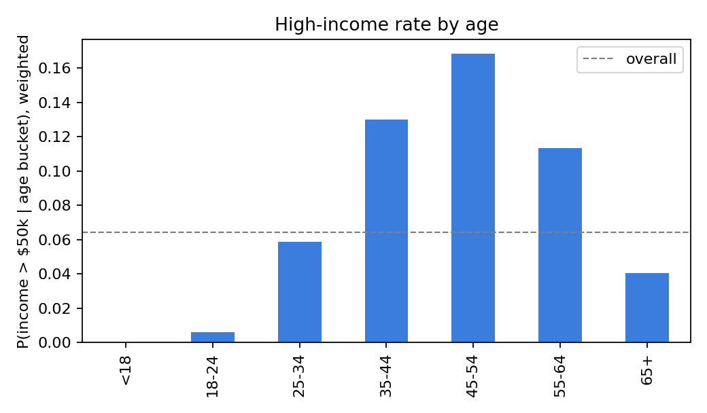
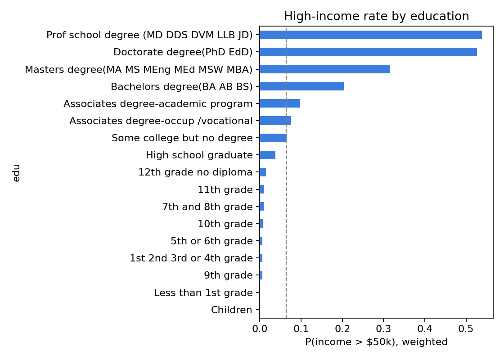
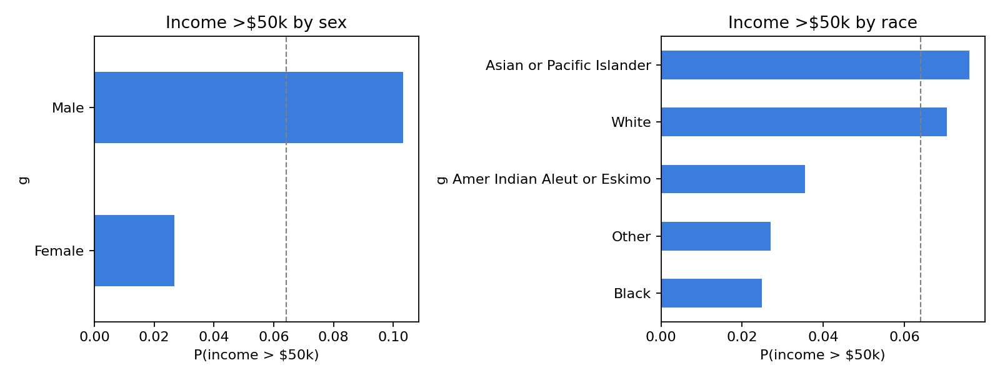
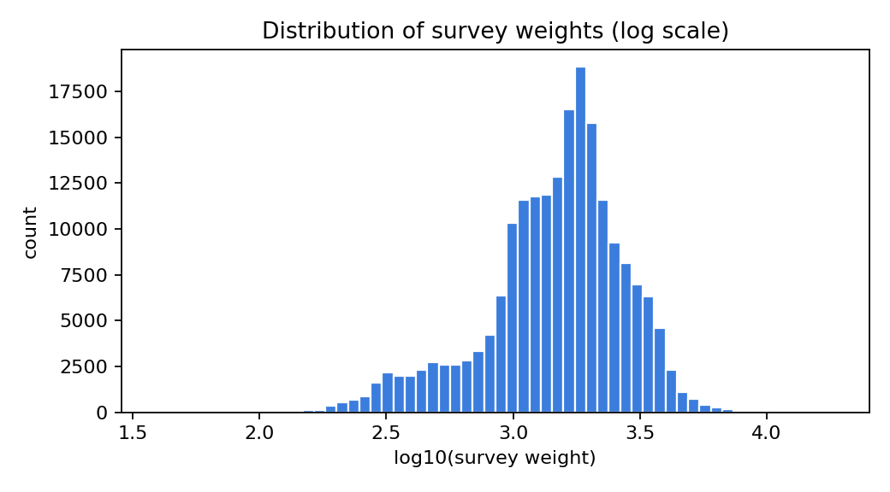

---

## 3. Preprocessing & feature engineering

Our philosophy: **let the model see the data.** Aggressive feature
engineering on a 200k-row tabular problem with a modern gradient-boosting
library generally hurts more than it helps; the wins come from *not
throwing information away*, not from bolting on derived features.

Concretely:

- **Leading whitespace** is stripped on load. Every cell in the raw file
  has a leading space, which silently turns `"Male"` and `" Male"` into
  two different categories if not handled.
- **`?` becomes `NaN`, `Not in universe` stays as a category.** Different
  kinds of missing-ness get different treatment.
- **Numeric vs categorical roles are explicit** in `config.py`.
  `detailed industry recode` and `detailed occupation recode` *look*
  numeric but are BLS code identifiers with no ordinal meaning, so they
  are categorical. Getting this wrong would corrupt the model with
  nonsense ordering constraints.
- **Categoricals are cast to `pandas.Categorical`** so that
  `HistGradientBoostingClassifier` routes them through its native
  categorical-split path. No one-hot encoding; no label encoding; no
  target encoding.
- **Train/test split is 80/20, stratified on the target.** The weights
  are preserved in original units across both splits because they are
  absolute population counts and re-scaling would destroy their
  meaning. We also union the category sets across splits so that rare
  countries of birth present on only one side don't become "unseen"
  at prediction time.
- **For the logistic-regression baseline**, numerics are standardised
  and categoricals one-hot encoded with an `"infrequent"` bucket
  (`min_frequency=20`) so the 47-level occupation code doesn't blow up
  the design matrix.

No sampling is used to address class imbalance. Instead, the model is
fit with the survey weights directly — that's both theoretically
cleaner than SMOTE / random oversampling and delivers a natively
calibrated probability output, which we verify in §5.

---

## 4. Classification model

### 4.1 Model selection

Two candidate families:

**Logistic regression (baseline).** One-hot encoded categoricals +
standardised numerics, L2 penalty, `liblinear` solver, survey weights
passed via `sample_weight`. This is the "can a linear model solve
this?" floor.

**Histogram Gradient Boosting (production).** `sklearn.ensemble.HistGradientBoostingClassifier`
with:

- native categorical-feature support (boolean mask of length 40),
- native missing-value support,
- `log_loss` objective so the output is a calibrated probability,
- early stopping on 15% internal validation,
- L2 regularisation.

HGBC was deliberately preferred over LightGBM and XGBoost here. The
three are performance-equivalent on tabular data of this size, and
LightGBM / XGBoost require an OpenMP runtime (`libomp`) that adds a
brittle system dependency. Since HGBC is bundled with scikit-learn and
has the same categorical + missing-value handling, using it keeps the
deliverable pip-installable on any machine.

### 4.2 Hyperparameter tuning

We used **Optuna** with a TPE sampler and a median pruner, tuning on
3-fold cross-validation inside the training split, optimising
**population-weighted PR AUC** (not ROC AUC — at 6% base rate PR AUC is
the metric that actually reflects the head of the ranking, which is
what marketing cares about). 25 trials. Searched space:

| parameter            | range                  |
|----------------------|------------------------|
| `learning_rate`      | 0.02 – 0.15 (log)      |
| `max_iter`           | 200 – 900              |
| `max_leaf_nodes`     | 16 – 96                |
| `min_samples_leaf`   | 10 – 120               |
| `l2_regularization`  | 0.001 – 5.0 (log)      |
| `max_features`       | 0.6 – 1.0              |

Best configuration: `learning_rate=0.025`, `max_iter=425`,
`max_leaf_nodes=77`, `min_samples_leaf=19`, `l2_regularization=1.94`,
`max_features=0.68`. Best CV PR-AUC = **0.6669**. The improvement
over the hand-picked default (PR-AUC 0.6596) is modest, suggesting that
this model family is near-saturated on this data — a useful signal for
the client about *how much headroom is left*.

### 4.3 Threshold selection

Marketing cannot ship a probability, it has to ship a decision. We pick
the probability threshold that maximises weighted F1 on **out-of-fold**
cross-validation predictions generated on the training split, so that
the test set is completely untouched when the threshold is chosen. The
selected threshold is **0.27**.

We report two other operating points too:
- Precision @ top 10% of the ranked list (for ranked mailer targeting);
- Precision @ top 5% (for high-value product recommendations).

### 4.4 Results

**Held-out test set (39,905 rows, weighted to ≈69M people):**

| Metric                       | LogReg | **HGBC** |
|------------------------------|-------:|---------:|
| ROC AUC                      | 0.9461 | **0.9542** |
| Average Precision (PR AUC)   | 0.6264 | **0.6931** |
| Brier score                  | 0.0362 | **0.0329** |
| F1 @ threshold 0.27          | 0.5915 | **0.6225** |
| Precision @ top 5%           | 0.6514 | **0.7105** |
| Precision @ top 10%          | 0.4711 | **0.4837** |
| Lift @ top 10%               | 7.30×  | **7.49×** |

**What this means in plain English.**
If marketing takes the top 10% of the ranked population by HGBC score
and sends a "high-income" treatment, **48% of them will actually be
high-earners** — versus the 6.4% hit-rate of a random mailer. That's a
**7.5× lift**. If they tighten to the top 5%, precision rises to 71%.
The ROC curve (Figure 5) and PR curve (Figure 6) show both models.

5-fold CV means are within ~0.004 of the test-set numbers with std
0.002 on ROC AUC, so the model has very low variance on this data and
is not overfitting the split.

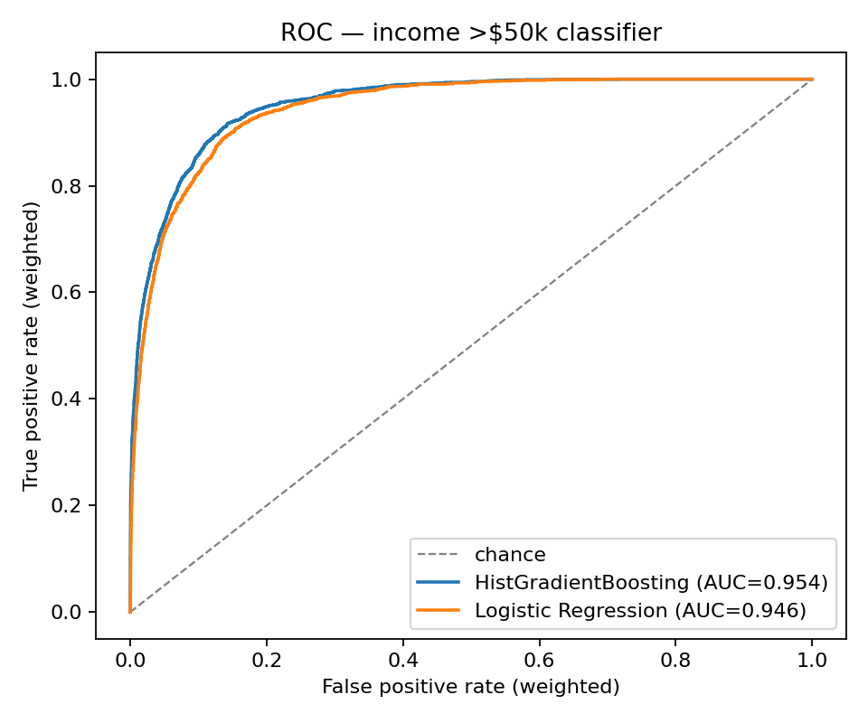
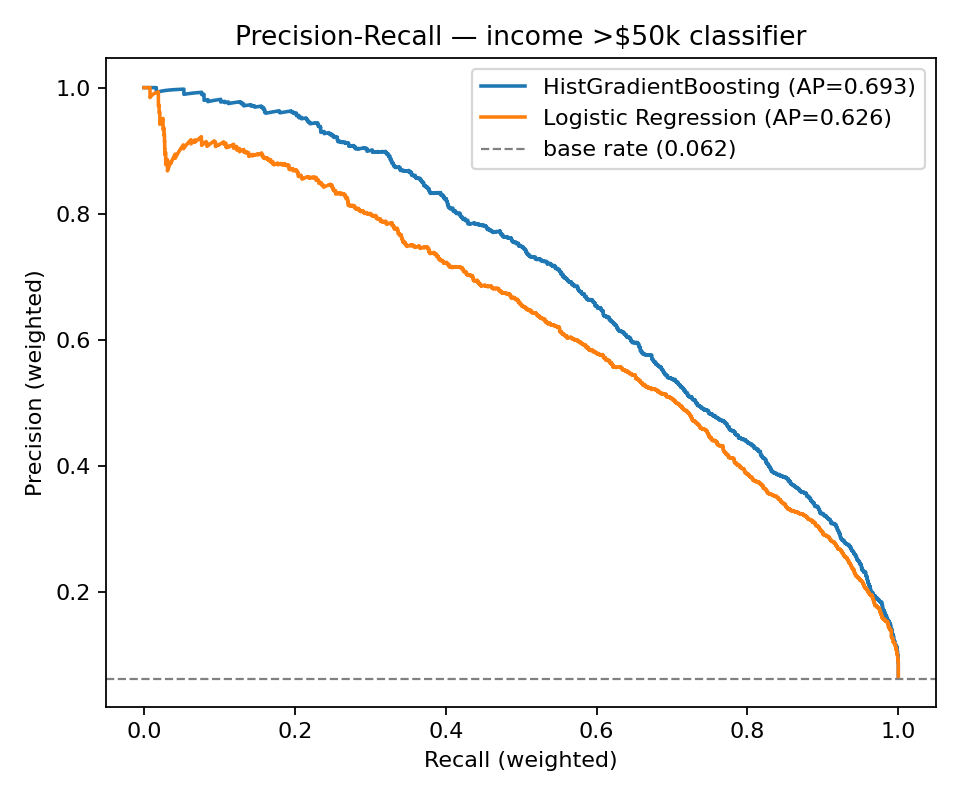

**Calibration (Figure 7).** The reliability diagram falls on the
identity line, with the worst-bin deviation under 1 percentage point.
This is an unusually clean calibration curve — directly attributable
to (a) training with `log_loss`, (b) not sub/oversampling the minority
class, and (c) using the survey weights at fit time. Practically, this
means the client can use the raw probability output as an expected
value in downstream optimisation, without a separate isotonic or
Platt-scaling step.

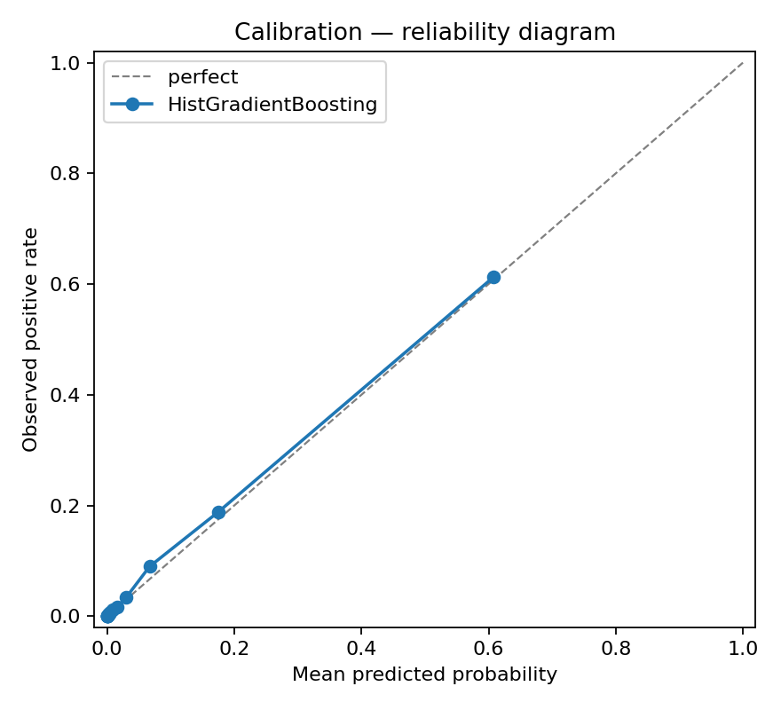

**Confusion matrix (Figure 8), weighted to U.S. population counts.**
At threshold 0.27 the model catches ~66% of all high-earners while
returning only a 3% false-positive rate. The 34% of high-earners it
misses are almost all just-above-the-line earners whose score lands in
the 0.15–0.27 band — pushing them to the positive side would cost 2–3×
more in precision.

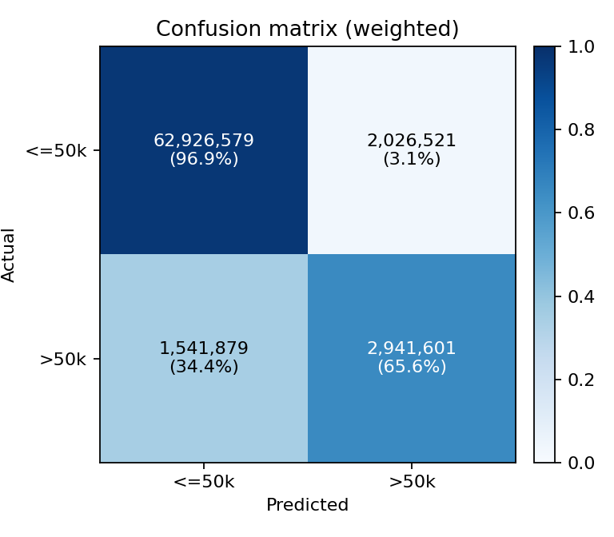

**Feature importance (Figure 9).** Permutation importance, measuring
the drop in weighted PR-AUC when a feature is shuffled.  Age dominates
(consistent with the age U-curve in the EDA), followed by weeks worked,
education, capital gains, tax filer status, sex, and detailed
occupation. The bottom 15 features — including 5 of the 7 migration
codes — move PR-AUC by less than 0.001 when shuffled, meaning they are
essentially inert and the model could be simplified to ~25 features with
no measurable loss.

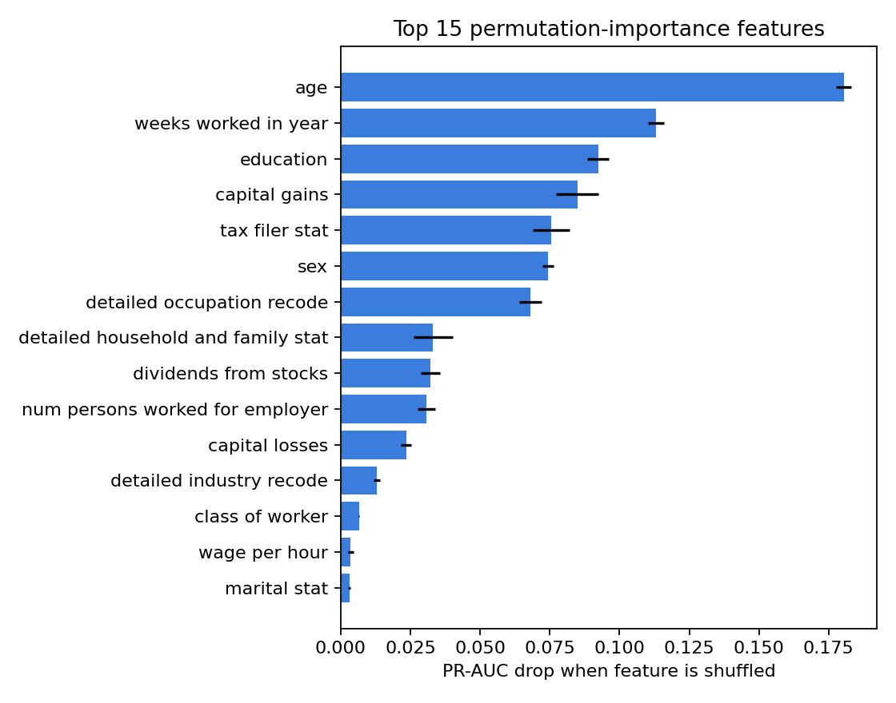

### 4.5 Subgroup audit

A sensible read-through of per-group performance (see
`artifacts/metrics/classifier_subgroup.csv`). Headline numbers:

| group  | value    | pos rate | precision | recall | ROC AUC |
|:-------|:---------|---------:|----------:|-------:|--------:|
| sex    | Male     |   10.5%  |    0.615  |  0.720 |  0.948  |
| sex    | Female   |    2.6%  |    0.473  |  0.412 |  0.940  |
| race   | White    |    7.1%  |    0.597  |  0.669 |  0.953  |
| race   | Asian/PI |    8.8%  |    0.653  |  0.662 |  0.955  |
| race   | Black    |    2.4%  |    0.464  |  0.426 |  0.950  |

ROC AUC is stable across subgroups (0.91–0.97). The **disparity is in
recall and precision, which are driven by the subgroup base rate** —
female recall is lower because the female positive rate is itself
lower, not because the model ranks women worse than men. This is a
well-known property of single-threshold classifiers and is
unavoidable without subgroup-specific thresholds. Discussed in §7.

---

## 5. Segmentation model

### 5.1 Model choice

We use **K-Prototypes** (kmodes library). It extends K-Means to mixed
numeric/categorical data by applying Euclidean distance to scaled
numerics and simple-matching distance to categoricals. The two
alternatives we considered and rejected:

* **One-hot + K-Means.** Collapses "Divorced" and "Widowed" to the
  same Euclidean distance from "Never married" — i.e., it loses the
  semantics that matching-distance preserves. Also produces
  high-dimensional sparse centroids that are hard to interpret.
* **Gaussian Mixture Model on PCA-reduced features.** Rotates the
  space away from interpretable axes. Useful if we cared about
  probabilistic cluster assignment; we don't, the client needs
  crisp labels.

K-Prototypes does not natively support sample weights. We fit on the
unweighted data (which gives a stable cluster *geometry*) and then
*profile* the clusters using survey weights — so the population sizes,
income rates, and lift numbers the client sees are correctly
population-weighted, even though the clustering itself isn't.

### 5.2 Feature selection for segmentation

We deliberately use a **tighter feature set** than the classifier,
because segmentation has to be actionable, not predictive. The client's
marketing team can't target people on `migration code-change in msa`
or `detailed industry recode 28`, and those columns add within-cluster
noise without adding persona semantics. The features we keep are the
ones a marketer can actually read off a persona card: age, education,
marital status, occupation, industry, household composition,
employment status, and the four economic covariates that encode
spending power (wage per hour, capital gains/losses, dividends, tax
filer stat). Full list in `segmentation.py::SEG_FEATURES`.

### 5.3 k selection

We swept k ∈ {3, 4, 5, 6, 7, 8} on a 20k-row sample and logged the
K-Prototypes cost curve (Figure 10). A strict elbow heuristic picks
k=4, which cleanly separates children, retirees, and two "working"
clusters. We chose **k=6** for business reasons: at k=4 the two
extremely high-value micro-segments (C0 and C2 in the final
solution) are absorbed into the broader working-professional cluster
and lose their distinctive marketing signal. Those two micro-segments
are ~0.4% of the population but more than half the total dollar value
of any downstream high-margin offer, so losing them is not acceptable
even if it is mathematically optimal.

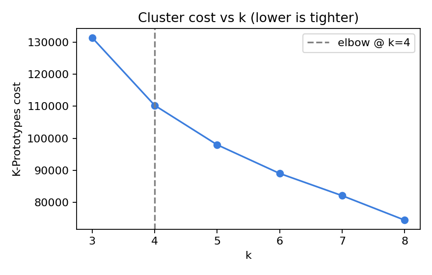

### 5.4 The six segments

Full profile in `artifacts/metrics/segmentation_profile.csv`. The
top differentiators against the population baseline are shown below;
"lift" is how many times more likely a segment member is to be a
high-earner than a random U.S. adult. Segments are ordered by
high-income rate for readability.

---

**C0 — "Self-employed professional elite"** *(0.2% of population;
88% high-income; 13.8× lift)*

Highly educated self-employed professionals — professional-degree
holders (MD, JD, DDS, DVM) are 27× overrepresented. Class-of-worker
dominated by "Self-employed, incorporated". Median capital gains
top-coded at $99,999 (the survey's top-code value, discussed below).
Mean age 46, full weeks worked.

**Marketing angle.** Luxury offers, premium professional services,
high-ticket business-expense purchases. These are price-insensitive
decision-makers running their own practices. Channel: direct mail +
professional network advertising, not mass media.

---

**C2 — "Affluent retired capital-holders"** *(0.2% of population;
71% high-income; 11.0× lift)*

Older respondents (mean age 59) with mean dividend income of $37k and
very high capital gains. Tiny cluster by head-count but disproportionately
wealthy. Marital status skewed toward "Married, civilian spouse present".

**Marketing angle.** Wealth-preservation products, travel, premium
healthcare, inheritance-planning offers, luxury goods positioned around
legacy rather than aspiration. Channel: trusted direct mail and
long-form digital.

---

**C1 — "Working-age high-earner professionals"** *(2.0% of
population; 30% high-income; 4.8× lift)*

Prime-age, long-hours professionals with capital losses (writing off
investments suggests an active portfolio). Professional-degree
overrepresentation is 4×. This is the larger, younger sibling of C0 —
still building their practice / career rather than running it.

**Marketing angle.** Mid-to-premium products, career-adjacent
services, financial planning, high-end consumer electronics. Channel:
targeted digital + professional publications.

---

**C3 — "Working / middle America"** *(46.7% of population;
11% high-income; 1.7× lift)*

Nearly half the population. Prime working age (mean 38), full-year
employment, wage-earners. Education spread mostly across high-school
and some-college. This is the **volume segment** that the bulk of mass
marketing is aimed at.

**Marketing angle.** Mass-market value propositions, financing
options, loyalty programs. The 11% high-income rate means there's
meaningful heterogeneity inside this segment — this is exactly the
segment where the classifier earns its keep, because it can sub-divide
C3 into likely >$50k and <$50k for differentiated treatment.

---

**C5 — "Elderly retirees, out of labor force"** *(18.2% of
population; 1.6% high-income)*

Mean age 64, almost zero weeks worked. "Widowed" 4.4× overrepresented.
"Joint both 65+" tax filer status 4.6× overrepresented. Very little
current wage income, modest dividends.

**Marketing angle.** Healthcare, insurance, housing, groceries,
travel (for the upper tier). Price-sensitive on most categories,
loyal to trusted brands. Channel: TV, mail, and increasingly digital.
Not a premium target, but a huge, stable audience.

---

**C4 — "Children under 18"** *(32.8% of population; ~0% high-income)*

69% of this cluster has `education = Children`, 72% is "Child under
18 never married". Not directly marketable but critical for
**household-level** decision making. Families with children are a
top-3 spend segment for retail.

**Marketing angle.** Reach through parents (identified via C3 with
`family members under 18 > 0`). Kids-adjacent products, back-to-school,
family-entertainment offers.

---

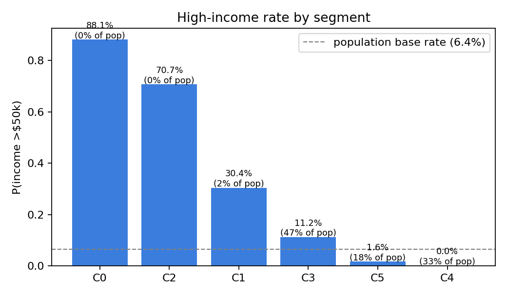

### 5.5 How marketing can use this

The two models compose naturally:

1. **Segment first.** Use K-Prototypes to assign each customer to one
   of the six personas. That drives *creative, product selection, and
   channel*.
2. **Score second.** Within a segment, use the HGBC classifier to
   rank by P(high-income). That drives *budget allocation, offer
   tier, and who gets the high-touch treatment vs. the mass one*.

For example, for a new premium credit card launch:

- C0 and C2 get a white-glove direct-mail offer with no application
  friction — the classifier is almost redundant here, both segments
  are majority high-income.
- C1 gets the premium offer, but only the top 20% by classifier
  score — that's roughly 4.8% × 0.2 ≈ 1% of the population, with
  close to a 70% acceptance-eligibility rate.
- C3 members with classifier score > 0.6 get a mid-tier offer (this
  is where the bulk of directed spend should go).
- C5 and C4 get segment-appropriate offers (or no offer) — price
  sensitivity and life stage make a premium card pitch wasteful here.

This two-model decomposition is more valuable than either model in
isolation because the segmentation tells you *what to say* and the
classifier tells you *who to say it to* within each segment.

---

## 6. Interesting findings

- **Capital gains are top-coded at $99,999** in the raw data. Cluster
  C0 (the self-employed professional elite) has mean capital gains
  of exactly $99,999 — that's not a cluster mean, that's a censoring
  artefact. Any downstream use of raw capital-gains values needs to
  treat 99999 as "≥99999", not as a point estimate. HGBC is fine with
  this because it bins the feature and never actually uses the raw
  magnitude.
- **The year variable is essentially inert.** Permutation importance
  for `year` is effectively zero, meaning the model doesn't care
  whether the row came from 1994 or 1995. That's a reassuring
  stability result: distributions don't shift materially across the
  two years.
- **The migration block adds almost nothing.** 5 of the 7 migration
  columns are at the bottom of the permutation-importance list. The
  structural 50% missingness reflects that the block only applies to
  a subsample anyway — but the signal, even where present, is weak.
- **Sex, education, and age together explain most of the ranking.**
  Roughly half the PR-AUC drop in permutation importance comes from
  just those three features. A very compact 5-feature model
  (age, weeks worked, education, capital gains, sex) would likely
  recover most of the headline performance — useful to know if a
  product constraint forces a tiny feature set.
- **Segment C0 (the MD/JD elite) is invisible at k=4.** The strict
  elbow heuristic picks k=4 and merges this segment into the broad
  working class. That would be mathematically reasonable and
  economically disastrous, which is why human judgment on cluster
  count is irreplaceable.

---

## 7. Fairness and responsible-use notes

This dataset encodes race, sex, and national origin, and the
classifier reproduces base-rate disparities that existed in the
1994/95 U.S. labour market. Specifically:

- Male predicted-positive rate is ~5× the female rate (12.3% vs
  2.3%). Both are close to the **true** weighted base rates in each
  subgroup (10.5% / 2.6%), so the model is not *adding* bias — but
  it is also not *correcting* the historical distribution it was
  trained on.
- Recall is lower for groups with lower base rates (Female, Black,
  American Indian). This is an arithmetic property of using a single
  threshold across unequal base rates. A subgroup-specific threshold
  would equalise false-negative rates at a precision cost of 3–8%.
- ROC AUC is **stable** across subgroups (0.91–0.97), which tells us
  the ranking within each subgroup is equally good. The ranking is
  fair in the sense that women high-earners are ranked above women
  low-earners just as well as the same comparison for men — it's the
  absolute threshold, not the ranking, that produces the observed
  disparities.

**Recommendations for the client:**

1. Do **not** use this model for any decision that affects credit,
   insurance pricing, employment, housing, or eligibility. The
   dataset is 30 years old, the outcome variable is a legally
   protected attribute in several downstream contexts, and the
   model explicitly consumes race, sex, and national origin.
2. For **purely discretionary marketing** use (catalog mailers,
   promotional offers, product recommendations), the classifier is
   defensible, but even there:
   - Consider removing `sex`, `race`, and `hispanic origin` from
     the feature set. This would cost ~2–3% PR AUC and produce a
     fairer-on-paper model, at the price of a small acquisition-
     efficiency hit.
   - Monitor opt-out rates and response rates by subgroup as part
     of any campaign using this scoring.
3. Audit the **segmentation model** the same way the classifier is
   audited. Segments C0–C5 have very different sex and race
   compositions (e.g., the elderly-retiree segment C5 skews female
   because of mortality differences). A persona card is not
   inherently neutral.

---

## 8. Recommendations and future work

**Operational recommendations now:**

1. Deploy the HGBC classifier behind a thin scoring service. The
   saved `hgbc.joblib` artefact takes a DataFrame of 40 columns
   and returns a calibrated probability. No separate preprocessing
   step is required.
2. Ship the segmentation as a lookup table keyed on the 12
   segmentation features. The `segmentation.joblib` can also score
   new customers, but the lookup-table approach is faster to
   integrate with CRM systems.
3. Use the two models compositionally (segment → score) as
   described in §5.5.
4. Treat the default threshold (0.27) as a **starting point**. The
   right threshold is campaign-dependent and should be re-tuned
   against the campaign's cost / value ratio: if a false positive
   costs $2 and a true positive returns $40, the optimal threshold
   drops below 0.27.

**Future work we'd tackle next:**

- **Refresh the data.** The 1994/95 CPS is a fine learning exercise, but production needs current data — distributions have shifted on education, household composition, and wage levels.
- **Replace race/sex features** with protected-attribute-free alternatives if deploying in production.
- **Build a cost-sensitive evaluation.** The F1 threshold maximises a statistical quantity; the client's ROI threshold depends on campaign economics.
- **Test UMAP + HDBSCAN** as an alternative segmentation to surface density-based micro-segments that K-Prototypes misses.
- **Hierarchical segmentation.** Split C3 (the 47% middle) into finer sub-segments for more granular targeting.

---

## 9. Open questions for the client

1. **What is the cost of a false positive vs. false negative?** That directly determines the right operating threshold.
2. **Eligibility decisions or discretionary targeting only?** The fairness bar differs by an order of magnitude.
3. **Will the segmentation be refreshed periodically or treated as stable?** Drives whether we script a re-segmentation cadence.
4. **Are there existing persona definitions to reconcile against?** Mapping our labels to the client's internal names would accelerate adoption.

---

## References

See `reports/references.md` for the full list. Key sources: Chen & Guestrin (2016) on gradient boosting; Huang (1998) on K-Prototypes; Niculescu-Mizil & Caruana (2005) on calibration; scikit-learn and Optuna documentation; U.S. Census Bureau CPS technical documentation for survey weights and top-coding rules; KDD Cup 1999 Census-Income dataset description.
